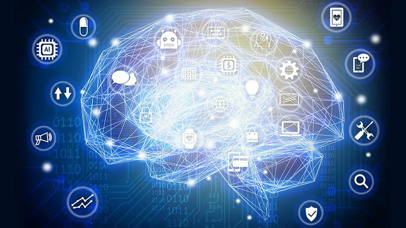

# Hi there, my name is Ovo. Welcome to my Profile Page! 👋

     

<h3 align="center"><em>I am a Technical Specialist with a keen focus on Data Science and Machine Learning Development.</em></h3>

With an Educational Background in Engineering Technology and Applied Sciences, I have been upskilling for the past couple of years in Data Science, and I have worked on a few Data Science projects, both individually and as part of a team.

I enjoy working with data, discovering valuable insights that help solve problems for businesses and other types of organizations.

I also love programming and am enhancing my skills in Python, JavaScript, Microsoft C#(.NET Core), and SQL (for database design, development and administration). I also gaining real world experience with Big Data and Cloud computing platforms that are utulized in Machine Learning and Business Intelligence Analytics job roles.

This is a sampling of the work I have been doing for the past couple of years, since I made a major career pivot into Data Science. Programming and developing solutions within the data space has become my passion and pursuit. I place a high value on personal growth and making positive contributions in a friendly team environment, and I am looking to do just that to help organizations build and develop their data strategy.

<h2> Some things you should know about me 👇</h2>
<ul>
<li>👨‍💻 I'm currently an <em>Applied Machine Learning </em> team contributor at <strong>ReVisionz Inc</strong>.</li>
<li>👨‍🔬 On the side (after hours) I also help out as a <em>Data Science Mentor</em> with <strong>The Lighthouse Labs Data Bootcamp</strong>.</li>
<li>☁  I have been studying and working on various <strong>Data Science and Machine Learning</strong> <em>Learning programs, individual and team projects, internships and fellowships</em> at <strong>since</strong> late 2019.</li>
<li>👨‍🎓 Making this switch into Data Science has become one of the best career decisions I have made.</li>
</ul>

<h3>My Skills include 👨‍💻</h3>

    
    
    
    
    
    
    
    
    
    
    
    
    
    
    
    
    

 

Here are some ideas to get you started:

- 🔭 I’m currently working on implementing Computer Vision models with YOLO Object Detector and Azure OCR.
- 🌱 I’m currently learning Artificial Intelligence Engineering on Microsoft Azure, building pipelines, and Productionizing Machine Learning models.
- 💬 Ask me about how to pivot into a tech career
- 📫 How to reach me: linkedin.com/in/ovokpus
- 😄 Pronouns: He/Him

- ## ⚡ Fun fact: I still have not yet seen "Star Wars"! Maybe someday, don't hold your breath.
