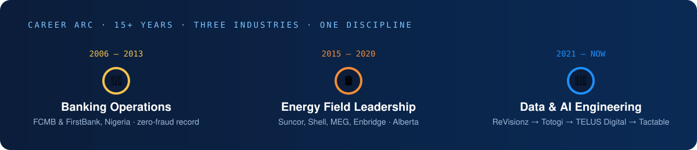

<!-- Header -->

  

  

  
  
  
  
  

---

## 👋 Hi, I'm Ovo

I'm a **Senior AI Engineer and Technical Lead at [Tactable](https://tactable.io)**, where I own end-to-end delivery of production AI systems for **tier-1 Canadian banking and AdTech clients** across Microsoft Azure, GCP and AWS. I take RAG agents, agentic workflows, ML inference pipelines and full-stack AI apps from solution architecture through security review, compliance and deployment.

Before tech, I spent over a decade leading teams under real consequence: running bank branch operations in Nigeria with a zero-fraud record, then leading safety-critical field crews in Alberta's energy sector. That background still shapes how I deliver. I own the work end to end, I care about risk, and I bring people along.

Making the switch into **Data Science** and ultimately **AI Engineering** has been the best career decision I have made.

📍 Calgary, Alberta · Remote-first · He/Him

---

## 🛠️ What I'm doing now

| | Role | Focus |
|:-:|---|---|
| 🏦 | **Senior Engineer**, Production RAG Agent | Microsoft Azure AI stack for a tier-1 Canadian bank, answering questions across millions of documents |
| 📺 | **Technical Lead**, DOOH AI Campaign Platform | Full-stack AI app for digital out-of-home campaign analysis and booking, architecture to production |
| ⚙️ | **Technical Lead**, AdTech AIOps/MLOps | ML and AI classification inference for AdTech creatives at scale, with automated retraining on data drift |
| 📐 | **Technical SME**, Spec-Driven Development | Enterprise banking in Canada |
| 🎓 | **FDE Technical Expert (SME)**, AI Makerspace | AI Makerspace FDE Program |
| ✍️ | **Digital Craftsmanship** | A newsletter on production AI patterns from the build floor. Launching soon |

---

## 🧭 Career arc

<table>
  <tr>
    <th>Years</th><th>Role</th><th>Highlights</th>
  </tr>
  <tr>
    <td><b>2025 – now</b></td>
    <td><b>Senior AI Engineer & Technical Lead</b> Tactable · Remote, Canada</td>
    <td>Production AI for a tier-1 Canadian bank and global AdTech clients: RAG agents, agentic workflows, ML inference pipelines, a full-stack AI campaign platform.</td>
  </tr>
  <tr>
    <td><b>2022 – 2025</b></td>
    <td><b>Data Engineer → Senior Data Engineer</b> Badal by TELUS Digital · Remote, Canada</td>
    <td>Led sprint execution for data teams serving tier-1 banks. Hadoop-to-GCP migration for BNS's Global Data Analytics Platform, dbt/BigQuery/Composer CI/CD, agentic AI on private Vertex AI endpoints.</td>
  </tr>
  <tr>
    <td><b>2022</b></td>
    <td><b>Data Engineer</b> Totogi (a TelcoDR company)</td>
    <td>Led technical delivery of the Totogi–AWS 4G/5G VoLTE pilot on Magma Core. Telco data pipelines on AWS Glue, DynamoDB and Athena.</td>
  </tr>
  <tr>
    <td><b>2021</b></td>
    <td><b>Applied ML Engineer</b> ReVisionz Inc · Calgary</td>
    <td>YOLO object detection and Azure OCR for Suncor Energy's Asset Data Lake Platform, cutting costs by more than 50%.</td>
  </tr>
  <tr>
    <td><b>2021</b></td>
    <td><b>Data Science Fellow</b> Cybera Inc & Hockey AI</td>
    <td>Helped develop a recommender system PoC.</td>
  </tr>
  <tr>
    <td><b>2015 – 2020</b></td>
    <td><b>Plant Lead & Crew Lead</b> Alberta energy sector</td>
    <td>Led safety-critical field crews for Suncor, Shell, MEG and Enbridge. Co-chaired the Joint Health and Safety Committee at Precise Downhole Solutions.</td>
  </tr>
  <tr>
    <td><b>2006 – 2013</b></td>
    <td><b>Head of Branch Operations</b> FCMB & FirstBank · Nigeria</td>
    <td>Ran branch operations across two locations: staff, enterprise risk, vault and profitability. Change agent for a bank-wide transformation. Zero-fraud record.</td>
  </tr>
</table>

---

## 🏗️ Production work

<table>
  <tr>
    <td width="50%" valign="top">
      <h4>🏦 Enterprise RAG Agent</h4>
      FINANCIAL SERVICES · AZURE  
      RAG agent for a tier-1 Canadian bank, answering questions across millions of documents. Delivered through security review, compliance and enterprise audit.  
      <code>Azure AI Foundry</code> <code>Azure OpenAI</code> <code>Qdrant</code> <code>LangGraph</code> <code>FastAPI</code>
    </td>
    <td width="50%" valign="top">
      <h4>📺 AI Campaign Management Platform</h4>
      ADTECH · FULL STACK  
      Full-stack AI application for DOOH campaign analysis and booking. Owned the delivery lifecycle from architecture to production.  
      <code>Azure Container Apps</code> <code>Bicep</code> <code>LangGraph</code> <code>React</code>
    </td>
  </tr>
  <tr>
    <td width="50%" valign="top">
      <h4>⚙️ ML Inference & Retraining Pipeline</h4>
      ADTECH · MLOPS  
      Production maintenance and retraining for a classification inference system serving AdTech creatives at scale, with retraining triggered by data drift.  
      <code>ONNX Runtime</code> <code>Azure ML</code> <code>Docker</code> <code>Python</code>
    </td>
    <td width="50%" valign="top">
      <h4>☁️ Hadoop → GCP Data Lake Modernization</h4>
      FINANCIAL SERVICES · GCP  
      CI/CD analytics pipeline moving Bank of Nova Scotia's on-prem Hadoop data lake and warehouse to GCP. Hive/Spark ETL, Qlik, SFTP and TAMR datasets.  
      <code>BigQuery</code> <code>dbt</code> <code>Cloud Composer</code> <code>Dataproc</code> <code>Terraform</code>
    </td>
  </tr>
  <tr>
    <td width="50%" valign="top">
      <h4>🤖 Agentic AI Workflow Suite</h4>
      FINANCIAL SERVICES · AGENTIC  
      Multi-agent workflows for Regulatory Reporting, Customer Service and domain research, with human-in-the-loop oversight on privately hosted Vertex AI.  
      <code>LangGraph</code> <code>LangSmith</code> <code>Qdrant</code> <code>Vertex AI</code>
    </td>
    <td width="50%" valign="top">
      <h4>🛢️ Asset Data Lake Computer Vision</h4>
      ENERGY · COMPUTER VISION  
      Object detection and OCR on industrial asset data for Suncor Energy, cutting costs by <b>more than 50%</b>.  
      <code>YOLO</code> <code>Azure Cognitive Services</code> <code>Python</code>
    </td>
  </tr>
</table>

---

## 🧰 Stack & tools

Each box runs from newest in my stack to longest-standing.

<table>
  <tr>
    <td width="33%" valign="top" align="center">
      <b>🤖 Agents & LLMs</b>  
       
       
       
       
       
       
    </td>
    <td width="33%" valign="top" align="center">
      <b>🧠 RAG & MLOps</b>  
       
       
       
       
       
       
    </td>
    <td width="33%" valign="top" align="center">
      <b>🛠️ AI-assisted engineering</b>  
       
       
       
       
       
       
    </td>
  </tr>
  <tr>
    <td width="33%" valign="top" align="center">
      <b>☁️ Cloud & IaC</b>  
       
       
       
       
       
       
    </td>
    <td width="33%" valign="top" align="center">
      <b>🔧 Data engineering</b>  
       
       
       
       
       
       
    </td>
    <td width="33%" valign="top" align="center">
      <b>🚢 Apps & languages</b>  
       
       
       
       
       
       
    </td>
  </tr>
</table>

---

## 🎓 Teaching & mentorship

| Where | When | What |
|---|---|---|
| 🤖 **AI Makerspace** | Sept 2025 – now | Peer Supporter, AI Engineering Bootcamp. Breakouts on LLMs in production, RAG and agentic AI |
| 🏫 **Lighthouse Labs** | 2021 – 2024 | Mentor in Data Science & Analytics. Bootcamp and corporate GenAI training, code reviews, curriculum support |
| ✍️ **Digital Craftsmanship** | 2026 | Newsletter on production AI patterns, translated into frameworks engineers can use. Launching soon |

💬 *Ask me about how to pivot into a tech career.*

---

## 🏫 Education

| Credential | Institution |
|---|---|
| Digital MBA, Technology Leadership | CTO Academy |
| MBA, Startup Ecosystems *(in progress)* | Augment Business School |
| Product Management with AI | Product Faculty |
| Data Science & Analytics | Bow Valley College |
| BAppTech, Petroleum Engineering | SAIT, Calgary |
| BSc, Industrial Chemistry | University of Benin, Nigeria |

---

## 📂 Projects & repositories

This is a sampling of the work I have been doing since I pivoted into data and AI. I place a high value on personal growth and making positive contributions in a friendly team environment. My all-time favourites are in the **Pinned Repositories** below. Here are the rest, grouped by area. Click to expand.

<b>🤖 Machine Learning & AI Engineering</b> (12)

 

1. [Retrieval-Augmented Generative AI Q&A Solution for Food Safety](https://github.com/ovokpus/vertex-gen-ai)
2. [Python-Azure-AI-REST-APIs](https://github.com/ovokpus/Python-Azure-AI-REST-APIs)
3. [Text Summarizer Flask Application](https://github.com/ovokpus/summarizer-app)
4. [Tensorflow BERT Sentiment Classifier](https://github.com/ovokpus/bert-sentiment-classifier)
5. [OpenAI Chat Application Deployed with Vercel](https://github.com/ovokpus/openai-chat-app)
6. [Chainlit Chatbot Application deployed with Huggingface](https://github.com/ovokpus/gh-llm-app)
7. [Collaborative Filtering Recommender Engine](https://github.com/ovokpus/collaborative-recommender)
8. [Income Prediction Pipeline - MLOps](https://github.com/ovokpus/Income-Prediction-Pipeline)
9. [My MLOps Learning Repository](https://github.com/ovokpus/MLOps-Learn)
10. [Azure AI Engineering Code Library](https://github.com/ovokpus/Azure-AI-Engineer-Code-Library)
11. [Azure Machine Learning Project](https://github.com/ovokpus/Azure-Machine-Learning-Project)
12. [Employee Attrition Predictor](https://github.com/ovokpus/Employee-Attrition-Predictor)

<b>🔧 Data Engineering</b> (10)

 

1. [AWS ETL Pipeline](https://github.com/ovokpus/AWS-ETL-Pipeline)
2. [Azure Streaming Pipeline](https://github.com/ovokpus/Azure-Streaming-Pipeline)
3. [Apache Airflow ETL](https://github.com/ovokpus/airflow-etl-pipeline)
4. [Document Streaming App with fastAPI, Kafka, Spark & MongoDB](https://github.com/ovokpus/document-streaming-pipeline)
5. [Analytics Engineering Prototype with dbt and BigQuery](https://github.com/ovokpus/analytics-engineering-prototype)
6. [Contact Tracing using Elasticsearch and Streamlit Frontend](https://github.com/ovokpus/contact-tracing)
7. [Time Series Analytics Pipeline with Python, InfluxDB and Grafana](https://github.com/ovokpus/time-series-analytics)
8. [Data Engineering with Hadoop - A Learning Project](https://github.com/ovokpus/Data-Engineering-with-Hadoop/tree/main)
9. [Airflow Learning Project - Astronomer](https://github.com/ovokpus/my-airflow-learning-project)
10. [Spark Application in Java](https://github.com/ovokpus/Java-Spark-Batch-Application/tree/main)

<b>📊 Data Science & Analytics</b> (4)

 

1. [Salary Prediction Prototype](https://github.com/ovokpus/Salary-Prediction)
2. [Car Manufacturing Test](https://github.com/ovokpus/Car-Manufacturing-Test)
3. [Customer Segmentation using RFM modelling and K-Means Clustering](https://github.com/ovokpus/Customer-Segmentation)
4. [Business Intelligence Gallery](https://github.com/ovokpus/my-bi-gallery)

<b>☁️ Cloud, Infrastructure & Full-Stack Playbooks</b> (13)

 

1. [Managing a GKE Multi-tenant Cluster with Namespaces](https://github.com/ovokpus/gke-multi-tenant-app)
2. [Building and Deploying a Docker image to a GKE Cluster](https://github.com/ovokpus/docker-gke-deploy)
3. [Deploying Google Cloud Applications with Terraform](https://github.com/ovokpus/GCP-Terraform-App-Deployment)
4. [Application Deployment with Google Kubernetes Engine (GKE)](https://github.com/ovokpus/GKE-Application-Deployment)
5. [GKE Multi-Tenant Cluster Management with Terraform Implementation Playbook](https://github.com/ovokpus/gke-multi-tenant-app/tree/main)
6. [US Cities API Backend](https://github.com/ovokpus/us-city-api)
7. [News Frontend Application - React](https://github.com/ovokpus/google-news-app)
8. [Valkyrie App - Deploying a golang Application with Kubernetes on Google Cloud](https://github.com/ovokpus/valkyrie-app)
9. [Report Notification Service - Resilient, Asynchronous Notification System with NodeJS, Cloud Run and Pub/Sub](https://github.com/ovokpus/report-notification-service)
10. [Google Cloud Architecture: GKE Design, Implementations, Optimizations and Management](https://github.com/ovokpus/GKE-Cluster-Management)
11. [REST API with Go, Firebase and Cloud Run](https://github.com/ovokpus/customer-data-rest-api)
12. [Serverless App with Cloud Run that Creates PDF Files with Golang and PubSub](https://github.com/ovokpus/cloud-run-pdf-converter-GO)
13. [Serverless App with Cloud Run that Creates PDF Files with Javascript and PubSub](https://github.com/ovokpus/cloud-run-pdf-converter-JS)

---

## 📜 Certifications

Over **40 professional certifications** across GCP, Azure, AWS, Databricks, dbt, Product Management and AI/ML, earned alongside active production work. See them on [Credly](https://www.credly.com/users/ovo) and [Accredible](https://www.credential.net/profile/ovookpubuluku516370/wallet).

<b>☁️ Cloud & platform certifications</b> (19)

 

  
  
  
  
  
  
  
  
  
  
  
  
  
  
  
  
  
  
  

<b>🏅 Google Cloud skill badges</b> (13)

 

  
  
  
  
  
  
  
  
  
  
  
  
  

<b>📚 Other certifications & programs</b> (38)

 

<b>🤖 AI & machine learning</b>

  
  
  
  
  
  
  
  
  
  
  
  
  

<b>🔧 Data engineering & analytics</b>

  
  
  
  
  
  
  
  
  
  

<b>🧭 Product, strategy & leadership</b>

  
  
  
  
  
  
  
  
  
  

<b>💻 Software & infrastructure</b>

  
  
  
  
  

---

> ⚡ **Fun fact:** I still have not seen *Star Wars*. Maybe someday. Don't hold your breath!

  <b>Let's connect</b>  
  
  
  
    
  Thanks for making it this far. Feedback is always appreciated.

